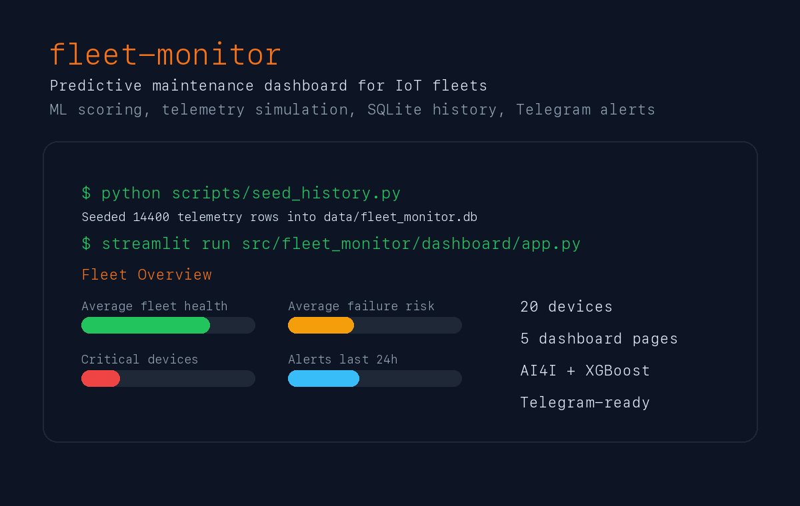

# fleet-monitor

End-to-end predictive maintenance system for IoT fleets.

Built to show applied ML, telemetry simulation, product-minded dashboard design, and production-aware Python engineering in one repo.



[](https://render.com/deploy?repo=https://github.com/19bk/fleet-monitor)

## Elevator Pitch

I built `fleet-monitor` as a compact flagship project that looks credible to IoT, data, and automation teams.

It combines:

- fleet telemetry simulation
- degradation-aware device modeling
- feature engineering on real failure data
- binary failure prediction and failure-mode hints
- alerting and historical storage
- a presentable dashboard someone can open in a browser

The goal was not just to train a model. The goal was to show that I can design the full system around it: data generation, storage, scoring, monitoring, alerting, packaging, and deployment.

## What This Project Says About Me

- I can turn a vague product idea into a working end-to-end Python system.
- I can bridge software engineering and applied ML instead of treating them as separate silos.
- I understand operational concerns: alerts, dashboards, local reproducibility, packaging, CI, and deployment.
- I can build recruiter-friendly demos that are technical enough for engineers and clear enough for hiring managers.

## What the demo shows

- Fleet Overview: latest fleet health, risk ranking, map/table view
- Device Detail: 24-hour sensor trend, current health, likely risk driver
- ML Predictions: failure probabilities, rough RUL estimate, model summary
- Alert History: critical, warning, and info maintenance alerts
- Model Performance: confusion matrix, ROC curve, feature importance

## Features

- Simulates 20 Kenyan field devices across pumps, generators, compressors, motors, and fuel dispensers
- Uses the UCI AI4I 2020 predictive maintenance dataset as the training base
- Stores telemetry and alerts in SQLite, so the demo is self-contained
- Trains a baseline Random Forest and a primary XGBoost model when `xgboost` is installed
- Falls back cleanly when optional packages like `xgboost`, `shap`, `folium`, or Telegram credentials are missing
- Ships with Docker, CI, tests, and a seeded dataset for fast startup

## Skills On Display

- Python application architecture
- Time-series simulation and synthetic telemetry generation
- Applied machine learning with scikit-learn and optional XGBoost
- Feature engineering on real-world failure data
- SQLite data modeling for demo-scale analytics systems
- Streamlit product dashboards
- Operational alerting patterns with Telegram integration
- Developer experience: packaging, testing, CI, Docker, deployment config

## Recruiter-Friendly Summary

If you are hiring for IoT software, data products, ML-enabled operations, or Python automation, this repo is the fastest way to see how I think. It shows that I can model a device fleet, build the scoring pipeline, surface risk in a usable interface, and ship a demo that other people can run without infrastructure drama.

## Quick Start

```bash
cd /Users/bernard/dev/fleet-monitor
python3 -m venv .venv
source .venv/bin/activate
python -m pip install --upgrade pip setuptools wheel
pip install -e '.[dev,viz,ml]'
python scripts/seed_history.py
streamlit run src/fleet_monitor/dashboard/app.py
```

The app will start on `http://localhost:8501`.

If you want the smallest workable install:

```bash
pip install -e .
python scripts/train_model.py
python scripts/seed_history.py
streamlit run src/fleet_monitor/dashboard/app.py
```

## Main Commands

```bash
python scripts/train_model.py
python scripts/seed_history.py
python scripts/run_simulator.py
python scripts/render_demo_gif.py
pytest
```

## Project Layout

```text
fleet-monitor/
├── data/
│   ├── ai4i2020.csv
│   └── fleet_config.json
├── docs/
│   └── demo.gif
├── scripts/
├── src/fleet_monitor/
│   ├── alerting/
│   ├── dashboard/
│   ├── ml/
│   ├── simulator/
│   └── storage/
├── tests/
├── Dockerfile
├── docker-compose.yml
└── render.yaml
```

## Local Development

```bash
python3 -m venv .venv
source .venv/bin/activate
python -m pip install --upgrade pip setuptools wheel
pip install -e '.[dev,viz,ml]'
python scripts/train_model.py
python scripts/seed_history.py
pytest
```

Key outputs:

- SQLite DB: `data/fleet_monitor.db`
- Trained model bundle: `artifacts/model_bundle.joblib`
- Demo GIF: `docs/demo.gif`

## Deploying A Live Demo

If you want a free public URL fast, use Streamlit Community Cloud.

If you want the app to stay up continuously without sleeping, use Render or Railway instead.

### Recommended always-on option: Render

This repo includes `render.yaml`, so you can deploy it with very little setup:

1. Push the repo to GitHub.
2. Create a new Blueprint on Render.
3. Point Render at this repository.
4. Let it build and start the Streamlit app.

The service runs:

```bash
python scripts/seed_history.py && streamlit run src/fleet_monitor/dashboard/app.py --server.address 0.0.0.0 --server.port $PORT
```

This gives you a stable public demo without the app sleeping on inactivity if you use a paid Render web service.

For this repo specifically, reseeding on boot is acceptable because the project is demo-first. If you want telemetry history to survive restarts and redeploys, move the data store off local SQLite or attach persistent storage.

### Fastest free option: Streamlit Community Cloud

Good for sharing quickly, but not for a true always-on public demo. It is best for a portfolio link when occasional wake-up delay is acceptable.

## Suggested GitHub Description

End-to-end predictive maintenance system: IoT telemetry simulation, ML failure prediction, SQLite history, Streamlit dashboard, and Telegram alerts.

## Environment Variables

- `TELEGRAM_BOT_TOKEN`
- `TELEGRAM_CHAT_ID`

Telegram delivery is optional. Without these, alerts are still generated and stored locally.

## Notes

- The animated GIF in `docs/demo.gif` is a lightweight preview asset for the README.
- Regenerate it any time with `python scripts/render_demo_gif.py`.
- The dashboard pages are implemented under `src/fleet_monitor/dashboard/pages/`.
